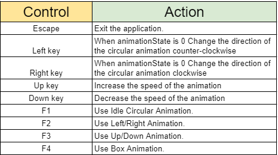

# TimbaProject

This project was created with OpenGL Glut c++.

The purpose of theis repo is to deliver the appropriate functionalities 
for the correct functioning of the test delivered by timba games, 
for the application of a video game developer.

To be honest, I am not familiar with c ++, but I found that using opengl together with the glut library, 
was the easiest way to carry out the challenge, it has 4 different classes, where I read the different 
files with their corresponding information, and then inherit them to the .cpp class where I do the necessary 
functions for the correct operation of the project.

